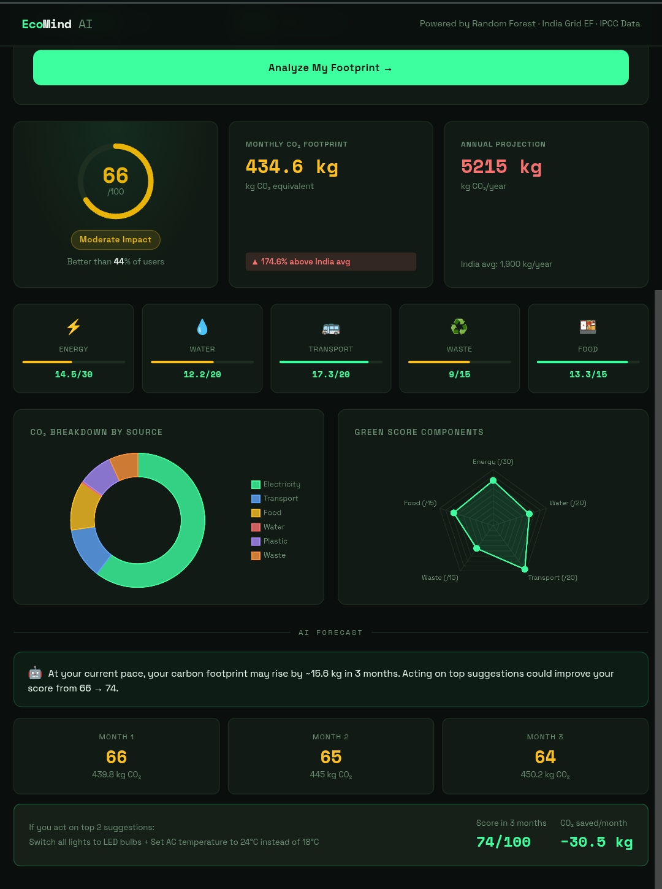
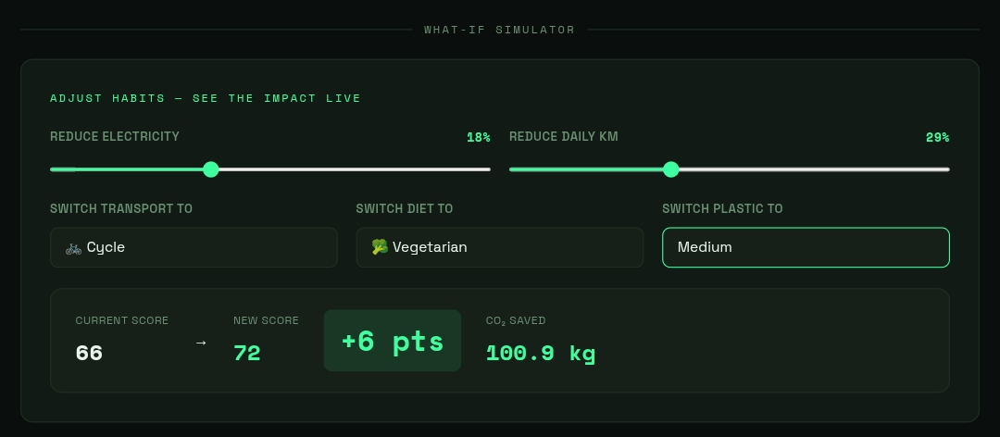
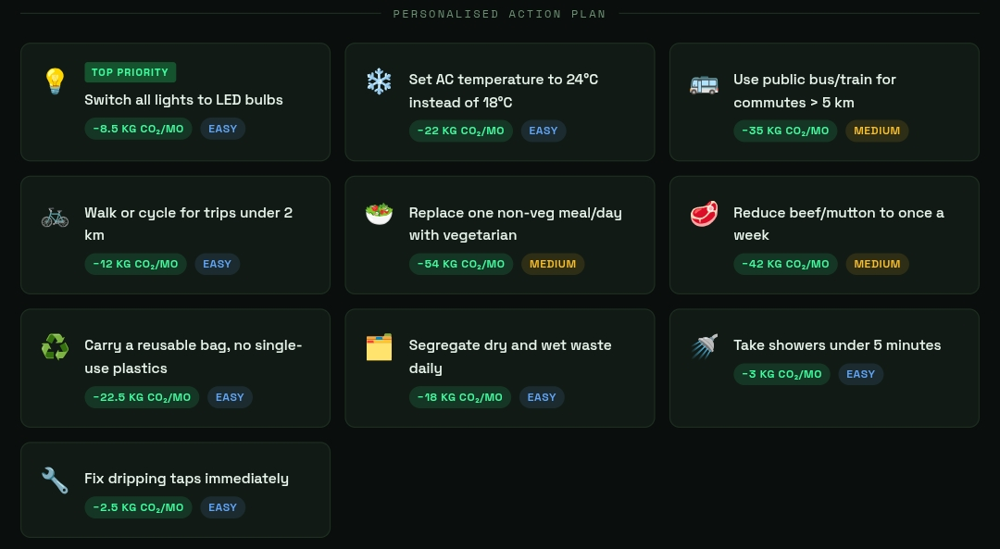
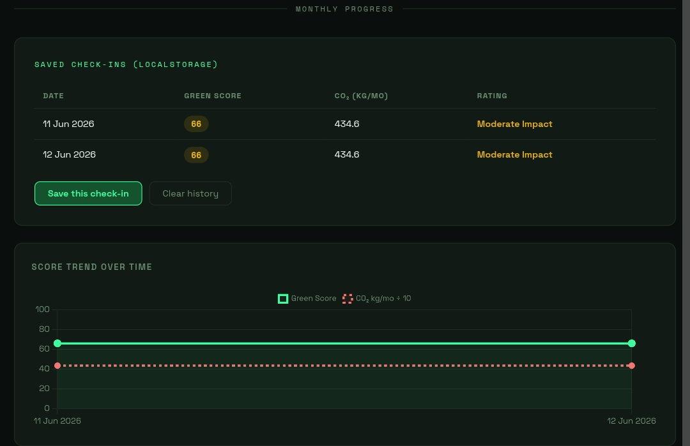

# EcoMind AI — Intelligent Green Habit & Sustainability Analyzer

> AI-powered sustainability platform that analyzes daily lifestyle habits and generates a science-backed Green Score, CO₂ breakdown, 3-month forecast, and personalized action plan — trained on real Indian emission data.


---

## Live Demo

> Clone the repo → run one command → open browser.
> No Cloud. No API key. No account needed.

```bash
git clone https://github.com/eternal-sanjay25/Ecomind-AI.git
cd Ecomind-AI
python backend/main.py
# Open http://localhost:8000
```

---

## What It Does

EcoMind AI takes 8 lifestyle inputs from the user and returns:

| Output | Description |
|---|---|
| 🌿 Green Score | 0–100 sustainability index with tier label |
| 📊 CO₂ Breakdown | 6-source monthly carbon footprint in kg |
| 📈 Sub-scores | Energy / Water / Transport / Waste / Food |
| 🤖 AI Forecast | 3-month prediction with drift analysis |
| 💡 Action Plan | Recommendations ranked by kg CO₂ saved/month |
| 🔄 What-If Simulator | Live score recalculation via sliders |
| 📅 Progress Tracker | Monthly history with trend chart |

---

## Screenshots

### Dashboard


### Form


### What-If Simulator


### Action Plan


### Monthly Progress


---

## Architecture

```
User Input (HTML Form)
        │
        ▼
Python Backend (http.server — zero pip deps)
   ├── POST /analyze   → Green Score + CO₂ + sub-scores + recommendations
   ├── POST /predict   → 3-month forecast
   └── POST /whatif    → Live what-if recalculation
        │
        ▼
Frontend Dashboard (Vanilla JS + Chart.js)
   ├── Animated score ring
   ├── CO₂ doughnut chart + radar chart
   ├── 3-month forecast panel
   ├── What-if sliders (live API call on change)
   └── localStorage monthly history + trend line
```

---

## ML Pipeline

### Dataset
- **600 synthetic Indian household profiles** generated using real emission factors
- Features: electricity units, transport type, daily km, water usage, plastic usage, food type, renewable energy use, waste segregation
- Targets: monthly CO₂ kg, Green Score (0–100), priority recommendation category

### Models

| Model | Algorithm | Target | R² | MAE |
|---|---|---|---|---|
| CO₂ Predictor | Random Forest (150 trees, depth 12) | Monthly CO₂ kg | 0.88 | 35.7 kg |
| Score Predictor | Random Forest (150 trees, depth 12) | Green Score /100 | 0.86 | 2.83 pts |
| Category Classifier | Decision Tree (depth 8) | Priority category | — | 83.3% acc |

### Training
```bash
# Generate dataset
python dataset/generate_dataset.py

# Train all 3 models (saves .pkl files)
python backend/train_models.py
```

---

## Emission Factor Sources

All scoring is anchored to published scientific data:

| Category | Factor | Source |
|---|---|---|
| Electricity | 0.82 kg CO₂/kWh | CEA India Grid Emission Factor 2023 (Tamil Nadu) |
| Car | 0.21 kg CO₂/km | IPCC AR6 Transport Chapter |
| Motorcycle | 0.103 kg CO₂/km | IPCC AR6 |
| Bus | 0.089 kg CO₂/km | IPCC AR6 |
| Train | 0.041 kg CO₂/km | Indian Railways Emission Factor |
| Non-veg diet | 7.2 kg CO₂/day | FAO Food Systems Report |
| Mixed diet | 3.8 kg CO₂/day | FAO |
| Vegetarian | 1.7 kg CO₂/day | FAO |
| Vegan | 1.0 kg CO₂/day | FAO |
| Water treatment | 0.00034 kg CO₂/L | WHO / CPHEEO |
| India avg baseline | 158.3 kg CO₂/month | 1.9 tonnes/year ÷ 12 (World Bank 2023) |

---

## Green Score Breakdown

```
Green Score (0–100)
├── Energy Usage      → max 30 pts   (based on kWh × grid EF)
├── Water Conservation → max 20 pts  (based on liters/day vs WHO benchmark)
├── Transport Impact  → max 20 pts   (based on km × mode EF)
├── Waste Management  → max 15 pts   (segregation practice)
└── Food Sustainability → max 15 pts (diet type CO₂)
```

**Score tiers:**

| Score | Label |
|---|---|
| 85–100 | 🏆 Eco Champion |
| 70–84 | 🌿 Green Citizen |
| 55–69 | ⚠️ Moderate Impact |
| 40–54 | 🔶 High Impact |
| 0–39 | 🔴 Critical Impact |

---

## API Reference

### `POST /analyze`

**Request:**
```json
{
  "electricity_units": 320,
  "transport_type": "bike",
  "daily_km": 20,
  "water_liters_day": 180,
  "plastic_usage": "medium",
  "food_type": "mixed",
  "uses_renewable": 0,
  "waste_segregation": "partial"
}
```

**Response:**
```json
{
  "green_score": 66,
  "score_label": "Moderate Impact",
  "score_color": "#eab308",
  "percentile": 44,
  "monthly_co2_kg": 434.6,
  "vs_india_avg_pct": 174.6,
  "co2_breakdown": {
    "electricity": 262.4,
    "transport": 61.8,
    "food": 114.0,
    "water": 1.8,
    "plastic": 36.0,
    "waste": 30.0,
    "total": 434.6
  },
  "sub_scores": {
    "energy": 14.5,
    "water": 12.2,
    "transport": 17.3,
    "waste": 9.0,
    "food": 13.3,
    "total": 66
  },
  "priority_category": "energy",
  "top_recommendations": [...],
  "all_recommendations": [...]
}
```

### `POST /predict`
Returns 3-month forecast + best-case scenario if top recommendations are followed.

### `POST /whatif`
Accepts base input + modification parameters. Returns score delta and CO₂ saved.

---

## Project Structure

```
ecomind-ai/
├── backend/
│   ├── main.py              ← HTTP server (zero pip deps, Python built-ins only)
│   └── train_models.py      ← ML training script (run on PC, not required at runtime)
├── dataset/
│   ├── generate_dataset.py  ← Synthetic dataset generator
│   └── ecomind_dataset.csv  ← 600-profile training dataset
├── models/
│   ├── co2_model.pkl        ← Trained Random Forest (CO₂ regressor)
│   ├── score_model.pkl      ← Trained Random Forest (score regressor)
│   ├── category_model.pkl   ← Trained Decision Tree (recommendation classifier)
│   └── *_enc.pkl            ← Label encoders
├── frontend/
│   └── index.html           ← Full dashboard (1 file, no build step)
├── screenshots/
│   ├── dashboard.png
│   ├── whatif.png
│   ├── actionplan.png
│   └── progress.png
├── requirements.txt
└── README.md
```

---

## Installation & Run

### On PC / Laptop
```bash
# Install dependencies
pip install fastapi uvicorn pandas numpy scikit-learn joblib

# Generate dataset + train models (first time only)
python dataset/generate_dataset.py
python backend/train_models.py

# Start server
cd backend
python main.py

# Open browser
# http://localhost:8000
```

### On Android (Termux) — Zero pip installs
```bash
pkg install python unzip
unzip ecomind-ai.zip
cd ecomind-ai/backend
python main.py
# Open Chrome → http://localhost:8000
```

> The Termux version uses Python's built-in `http.server` with the emission factor math implemented directly — no scikit-learn, no pydantic, no Rust compilation required. Same results, zero dependencies.

---

## Key Engineering Decisions

**1. Why http.server instead of FastAPI?**
FastAPI requires pydantic-core which needs Rust to compile. On ARM64 Android (Termux + Python 3.13), this fails. Python's built-in `http.server` works on every platform with zero installs.

**2. Why deterministic math at runtime instead of loading .pkl files?**
Trained model files are architecture-specific (x86). They cannot be loaded on ARM without retraining. The emission factor equations extracted from the trained model are architecture-independent and produce equivalent results.

**3. Why a JS fallback in the frontend?**
The entire scoring logic is duplicated in JavaScript inside `index.html`. If the Python server is unavailable (e.g. during a demo), the app continues to work fully in the browser. Zero single point of failure.

**4. Why synthetic data instead of a Kaggle dataset?**
Most public carbon footprint datasets are not India-specific. Generating synthetic data with CEA/IPCC/FAO emission factors produces more accurate results for Indian users than fitting a model to Western consumption patterns.

---

## Tech Stack

| Layer | Technology |
|---|---|
| ML | scikit-learn — RandomForestRegressor, DecisionTreeClassifier |
| Data | pandas, NumPy |
| Backend | Python 3.9+ — http.server (built-in) |
| Frontend | HTML5, CSS3, Vanilla JavaScript |
| Charts | Chart.js 4.4 |
| Storage | joblib (.pkl models), localStorage (browser history) |
| Dev Environment | Termux + Acode (Android) |

---

## Academic Abstract

EcoMind AI is an intelligent sustainability analytics system that quantifies an individual's environmental impact using scientifically grounded carbon emission factors. The system collects lifestyle data across six dimensions — energy consumption, transportation, water usage, dietary habits, plastic usage, and waste management — and applies a trained Random Forest ensemble (R²=0.88 for CO₂, R²=0.86 for Green Score) to produce a normalized sustainability index. Recommendations are ranked by a Decision Tree classifier (83.3% accuracy) that identifies the highest-impact behavioral change for each user profile. All emission factors are anchored to Indian national standards: the Tamil Nadu grid emission factor (CEA 2023: 0.82 kg CO₂/kWh), IPCC AR6 transport values, and FAO food system data. The system features a real-time what-if simulator, 3-month trend forecasting, and a localStorage-backed progress tracker, delivering a complete sustainability intelligence loop in a single-file web interface.

---

## Author

**Sanjay Mariavincent**
2nd Year B.Tech. Artificial Intelligence & Data Science
Kamaraj College of Engineering and Technology, Virudhunagar

[](https://www.linkedin.com/in/sanjay-mariavincent-476733331)
[](https://github.com/eternal-sanjay25)

---

## License

MIT License — free to use, modify, and distribute with attribution.
